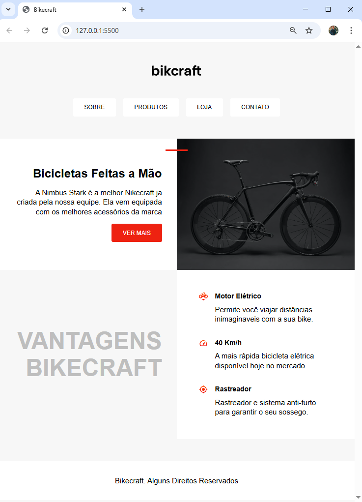

### Página HTML e CSS

- #### Projeto de estudo de HTML e CSS com página web de venda de uma bicicleta com responsividade.

### Tecnologias:

 

### Funcionalidades utilizadas:

- Página de venda responsiva

### Visualização:

